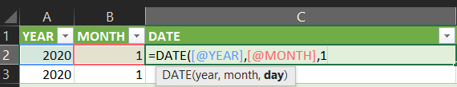
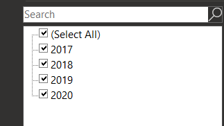
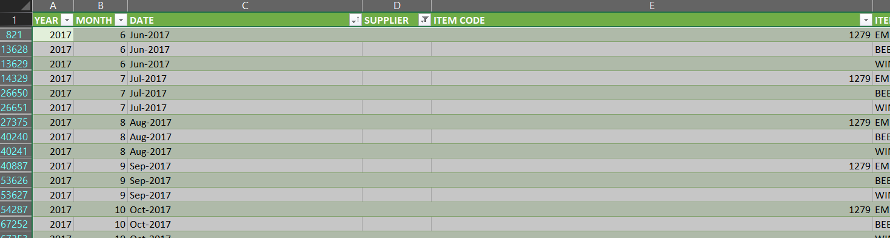
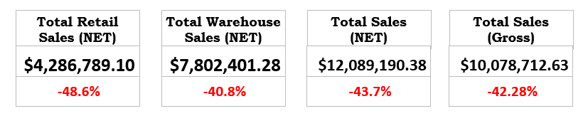
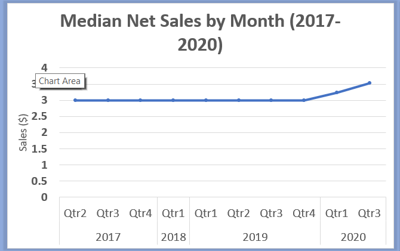
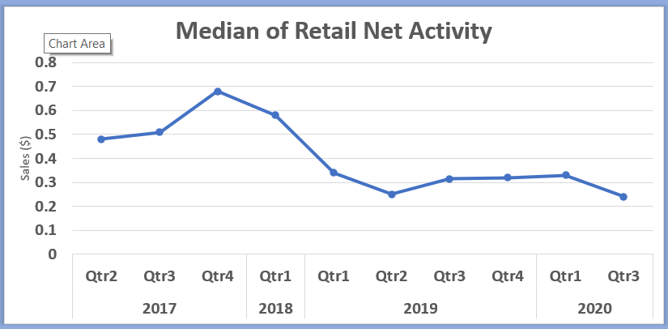
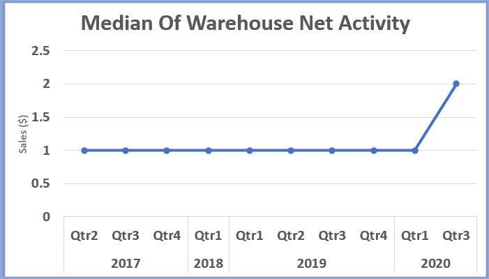
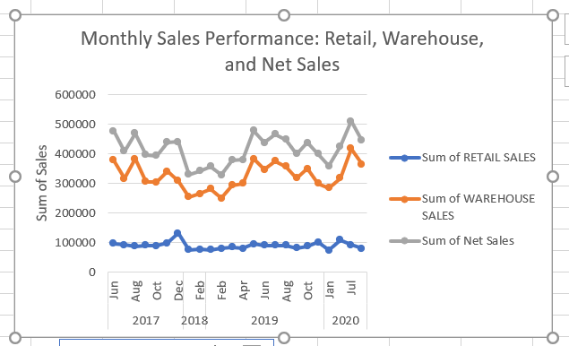

# Warehouse and Retail Sales Performance Analysis (2017-2020)

A comprehensive analysis of sales trends across retail and warehouse channels, revealing significant market shifts and the impact of external factors on business performance.

---

## 📊 Project Overview

This project analyzes sales performance data from a dataset containing **307,640 rows** and **9 columns**, spanning from 2017 to 2020. The analysis examines retail sales, warehouse sales, and net activity across multiple distribution channels to identify trends, volatility patterns, and business insights.

**Key Focus Areas:**
- Sales channel classification and performance
- Year-over-year trend analysis
- Median activity tracking (accounting for high data variability)
- Impact of market disruptions (2018 decline, 2020 pandemic effects)

---

## 🔧 Data Preparation

### Dataset Details
- **Source:** `Warehouse_and_Retail_Sale.csv`
- **Records:** 307,640 rows
- **Features:** 9 columns

### Cleaning Steps

1. **Date Standardization**
   - Combined `YEAR` and `MONTH` columns into a single `DATE` column
   - Sorted data chronologically from oldest to newest

  

2. **Missing Data Handling**
   - Filtered out blank rows in the `SUPPLIER` column

 

3. **Negative Values Treatment**
   - Retained negative values as they represent valid business activities:
     - Product returns
     - Reversals and corrections
     - Inventory adjustments

---

## 🧮 Methodology

### Net Activity Calculation

To accurately determine channel activity, net activity metrics were computed:

```
Retail_Net_Activity = RETAIL SALES + RETAIL TRANSFERS
Warehouse_Net_Activity = WAREHOUSE SALES
```

**Rationale:** Raw sales values alone don't capture the full picture. A channel with negative sales (returns) or mixed positive/negative values still represents active business operations.

### Sales Channel Classification

Each record was classified based on net activity:

| Retail Net Activity | Warehouse Net Activity | Classification |
|---------------------|------------------------|----------------|
| ≠ 0 | = 0 | **Retail Only** |
| = 0 | ≠ 0 | **Warehouse Only** |
| ≠ 0 | ≠ 0 | **Both** |
| = 0 | = 0 | **None** |

**Design Principle:** Channel classification (where activity occurred) and sales direction (positive/negative) are treated as separate analytical dimensions.

---

## 📈 Key Findings

### Overall Performance Summary (2017-2020)

| Metric | 2017 | 2020 | Change | % Change |
|--------|------|------|--------|----------|
| **Total Retail Sales (NET)** | $1,363,355 | $700,935 | -$662,420 | **-48.6%** ⬇️ |
| **Total Warehouse Sales (NET)** | $2,340,495 | $1,386,457 | -$954,038 | **-40.8%** ⬇️ |
| **Total Sales (NET - Overall)** | $3,703,850 | $2,087,392 | -$1,616,458 | **-43.7%** ⬇️ |
| **Total Sales (Gross)** | $3,068,917 | $1,754,437 | -$1,314,480 | **-42.8%** ⬇️ |



### Year-Over-Year Trends

#### Total Retail Sales (NET)
- **2017 → 2018:** -77.5% (sharp decline)
- **2018 → 2019:** +523.3% (massive recovery)
- **2019 → 2020:** -63.4% (significant drop)

#### Total Warehouse Sales (NET)
- **2017 → 2018:** -77.8% (sharp decline)
- **2018 → 2019:** +584.1% (massive recovery)
- **2019 → 2020:** -61.0% (significant drop)

#### Total Sales (NET - Overall)
- **2017 → 2018:** -77.7% (sharp decline)
- **2018 → 2019:** +561.4% (massive recovery)
- **2019 → 2020:** -61.9% (significant drop)

---

## 📉 Median Activity Analysis

### Why Median Over Mean?

The dataset exhibits **extremely high variability** (standard deviation often exceeding 200). Outliers such as blockbuster deals and large portfolio sales heavily skew the mean, making it unrepresentative of typical transactions. **Median values provide a more reliable measure of central tendency.**

### Quarterly Median Trends

#### 1. Overall Net Sales (Combined Sectors)
- **2017-2019:** Stable at approximately $3.00
- **Late 2019:** Minor dip
- **2020:** Notable increase to ~$3.50, reflecting market dynamics shifts



#### 2. Retail Net Sales Activity
- **2017:** Peak around $0.70
- **2018-2019:** Sharp, sustained decline to $0.25-$0.30
- **2020:** Stabilized at depressed levels
- **Insight:** Reflects structural challenges in traditional retail, including e-commerce competition and COVID-19 impacts



#### 3. Warehouse Net Sales Activity
- **2017-2019:** Extremely stable at ~$1.00
- **2020:** Dramatic surge to $2.00-$2.10
- **Insight:** Pandemic-driven boom in e-commerce fulfillment and logistics demand



---

## 📅 Monthly Performance Patterns



### Sales Distribution
- **Warehouse Sales:** Largest revenue stream, consistently 3-4x higher than retail ($250K-$400K range)
- **Retail Sales:** Relatively stable around $100K with minimal fluctuation
- **Net Sales:** Closely mirrors warehouse trends ($400K-$500K range), indicating warehouse operations drive overall performance

### Seasonality & Events
- **Mid-2018:** Dip across all channels (potential market challenges)
- **Late 2018-2019:** Recovery and growth trajectory
- **July 2020:** Strong performance spike (seasonal demand or successful campaigns)

---

## 💡 Business Insights

### Critical Observations

1. **Extreme Volatility:** The business experienced severe fluctuations, with a catastrophic 2018 decline, exceptional 2019 recovery, and another sharp 2020 downturn

2. **Systemic Factors:** All sales categories followed nearly identical patterns, suggesting company-wide or market-wide influences rather than channel-specific issues

3. **Channel Divergence:** By 2020, warehouse operations showed remarkable strength while retail continued declining, highlighting the shift toward distribution and fulfillment

4. **Pandemic Impact:** The 2020 warehouse surge and retail stagnation clearly reflect COVID-19's acceleration of e-commerce and logistics demand

---

## 🎯 Strategic Recommendations

### Immediate Actions
1. **Root Cause Analysis**
   - Investigate factors behind the 2018 collapse
   - Analyze 2020 retail decline drivers
   - Assess competitive landscape changes

2. **Channel Strategy Realignment**
   - Prioritize warehouse/fulfillment expansion
   - Reevaluate retail footprint and operations
   - Develop omnichannel integration approach

### Long-Term Initiatives
3. **Stability Mechanisms**
   - Implement volatility monitoring systems
   - Develop early warning indicators
   - Create contingency plans for market disruptions

4. **Growth Strategy**
   - Capitalize on warehouse momentum
   - Explore e-commerce partnerships
   - Invest in logistics infrastructure

5. **Market Intelligence**
   - Conduct comprehensive competitor analysis
   - Monitor external economic indicators
   - Track consumer behavior shifts

---

## 🛠️ Technical Stack

- **Data Processing:** Excel
- **Visualization:** Microsoft Excel
- **Analysis Period:** Q2 2017 - Q3 2020
- **Metrics:** Sales volume, net activity, quarterly medians

---

## 📁 Repository Structure

```
├── data/
│   └── Warehouse_and_Retail_Sale.csv
├── images/
│   ├── Picture2.png (Dataset overview)
│   ├── picture3.png (Filtered data)
│   ├── picture4.png (Sorted dates)
│   ├── picture5.png (Overall performance)
│   ├── picture6.png (Median overall net sales)
│   ├── picture7.png (Median retail sales)
│   ├── picture8.png (Median warehouse sales)
│   └── picture9.png (Monthly performance)
├── dashboard/
│   └── interactive_dashboard
├── analysis/
│   └── warehouse_retail_analysis.xlsx
└── README.md
```

---

## 🚀 Usage

This repository serves as a reference for:
- Historical retail vs. warehouse sales performance analysis
- Understanding pre-pandemic and early-pandemic market dynamics
- Methodological approach to handling negative values in sales data
- Median-based analysis for high-variability datasets

**To extend this analysis:**
1. Fork the repository
2. Add more recent data (post-2020)
3. Incorporate additional sectors or metrics
4. Apply similar methodology to your own sales data

---

## 📝 License

MIT License – Free to use, modify, and distribute with attribution.

---

## 📧 Contact

For questions or collaboration opportunities, please open an issue or reach out via [Ezra Val Okere on linkedin](www.linkedin.com/in/ezra-val-okere-1a84b4273).

---

**Last Updated:** January 2026
